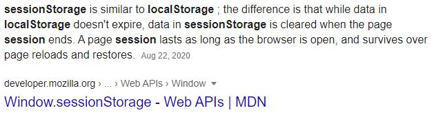
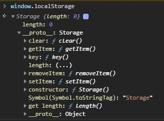
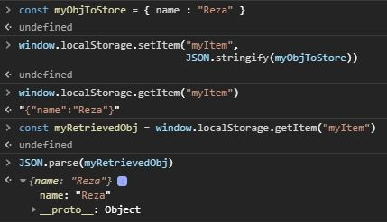
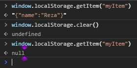

<h2 style="text-align: center">Local Storage vs Session Storage</h2>

---

Both local storage and session storage have `getItem` and `setItem`. We can visualize that in the console.

---

Now, let's store some info into the storage.

If we refresh the page or close the tab and then open it again, we'll still be able to see what's store in the local storage.

If we want to remove ceratin item or clear everything from the local storage there are `removeItem` and `clear` method int the `window.localStorage` command.

