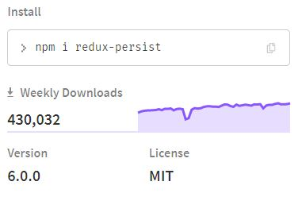
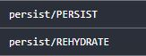

### redux-persist

It is a very handy package for storing data. It's usage can be found here: [documentation](https://www.npmjs.com/package/redux-persist)



If we use this, two extra actions will be fired. We can visualize that in the redux devtool



Mainly we'll need this for our application:

```js
import { persistStore, persistReducer } from "redux-persist";
```

As their name suggested, we'll use `persistStore` to wrap our store and `persistReducer` to wrap our `rootReducer`.

Go to the `rootReducer.js` file.

```js
import { persistReducer } from "redux-persist";
import storage from "redux-persist/lib/storage"; // sessionStorage

const persistConfig = {
  key: "root",
  storage,
  whitelist: ["cart"], /// which reducer we want to store
};

const rootReducer = combineReducers({
  user: userReducer,
  cart: cartReducer,
  directory: directoryReducer,
  shop: shopReducer,
});

export default persistReducer(persistConfig, rootReducer);
```

In short `persistReducer(config, reducer)`

- config:
  - required config: key, storage
  - notable other config: whitelist, blacklist
- reducer:
  - any reducer will work, typically this would be the top level reducer returned by `combineReducers`.

This `persistReducer` returns an enhanced reducer.

---

Now go to the `store.js` file

```js
import { persistStore } from "redux-persist";
import rootReducer from "./rootReducer";

export const store = createStore(
  rootReducer,
  composeEnhancer(applyMiddleware(...middlewares))
);

export const persistor = persistStore(store);
```

---

Finally, we need to wrap our root file with `persistGate`.

```js
import { PersistGate } from "redux-persist/integration/react";
import { store, persistor } from "./redux/store";

ReactDOM.render(
  <Provider store={store}>
    <BrowserRouter>
      <PersistGate persistor={persistor}>
        <App />
      </PersistGate>
    </BrowserRouter>
  </Provider>,
  document.getElementById("root")
);
```

wrapping root component with PersistGate delays the rendering of app's UI until persisted state has been retrieved and saved to redux.
