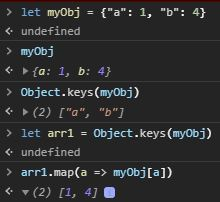

Our shop data stored as object.

```js
export const selectCollectionsForPreview = createSelector(
  [selectShopItems],
  (collections) => Object.keys(collections).map((key) => collections[key])
);
```

If we want to map through the shop data, we need to convert this data into array.



```js
const zoo = {
  lion: "🦁",
  panda: "🐼",
};

Object.keys(zoo);
// ['lion', 'panda']

Object.values(zoo);
// ['🦁', '🐼']

Object.entries(zoo);
// [ ['lion', '🦁'], ['panda', '🐼'] ]
```

> Why we converted the shop data from array to object?

It is called data normalization. Map through large array is ineffecient, that's why we used object.
